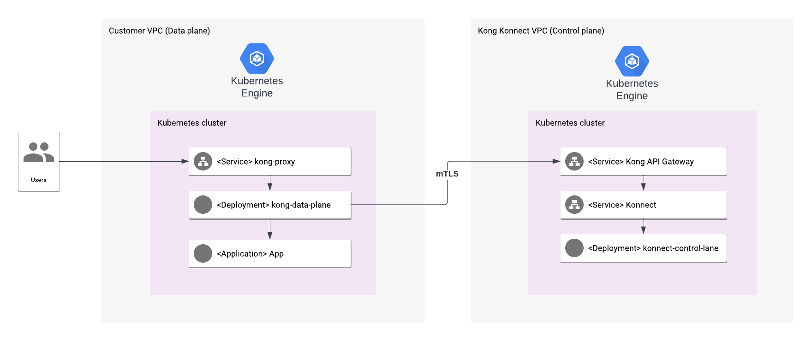

# Overview

Konnect is an API lifecycle management platform designed from the ground up for the cloud native era and delivered as a service. This platform lets you build modern applications better, faster, and more securely. The management plane is hosted in the cloud by Kong, while the runtime engine, Kong Gateway — Kong’s lightweight, fast, and flexible API gateway — is managed by you within your preferred network environment.

To learn more about Kong Konnect, see the [Kong Konnect](https://docs.konghq.com/konnect/).

The Kong Konnect platform provides a cloud control plane (CP), which manages all service configurations. It propagates those configurations to all runtime nodes, which use in-memory storage. These nodes can be installed anywhere, on-premise or in the cloud.

This application is pre-configured with an SSL certificate. While you are
installing the application using the steps below, you must replace the
certificate with your own valid SSL certificate.

## About Google Click to Deploy

Popular open stacks on Kubernetes packaged by Google.

## Architecture



Runtime instances, acting as data planes, listen for traffic on the proxy port 443 by default. The Konnect data plane evaluates incoming client API requests and routes them to the appropriate backend APIs. While routing requests and providing responses, policies can be applied with plugins as necessary.

For example, before routing a request, the client might be required to authenticate. This delivers several benefits, including:

The service doesn’t need its own authentication logic since the data plane is handling authentication.
The service only receives valid requests and therefore cycles are not wasted processing invalid requests.
All requests are logged for central visibility of traffic.

# Installation

## Setup a Konnect account and configure A Runtime
Kong Gateway data planes proxy service traffic. With Konnect Cloud working as the control plane, a runtime doesn’t need a database to store configuration data. Instead, configuration is stored in-memory on each node, and you can easily update multiple runtimes from one Konnect account with a few clicks.

Kong Gateway data planes proxy service traffic.

1. From the left navigation menu, open runtimes icon Runtime Manager.

2. Select the default runtime group.

3. Every account starts with one group named default. If you have an Enterprise subscription, you can create additional custom groups.

4. Click Add runtime instance.

The page opens to a runtime configuration form with the Docker tab selected. Here you will find variables that you would need to use on the next steps.


## Quick install with Google Cloud Marketplace

Get up and running with a few clicks! Install this Konnect app to a Google
Kubernetes Engine cluster using Google Cloud Marketplace. Follow the
[on-screen instructions](https://console.cloud.google.com/marketplace/details/google/konnect).

## Command line instructions

You can use [Google Cloud Shell](https://cloud.google.com/shell/) or a local
workstation to complete the following steps.

### Prerequisites

#### Set up command-line tools

You'll need the following tools in your development environment. If you are
using Cloud Shell, `gcloud`, `kubectl`, Docker, and Git are installed in your
environment by default.

-   [gcloud](https://cloud.google.com/sdk/gcloud/)
-   [kubectl](https://kubernetes.io/docs/reference/kubectl/overview/)
-   [docker](https://docs.docker.com/install/)
-   [git](https://git-scm.com/book/en/v2/Getting-Started-Installing-Git)
-   [helm](https://helm.sh/)

Configure `gcloud` as a Docker credential helper:

```shell
gcloud auth configure-docker
```

#### Create a Google Kubernetes Engine cluster

Create a new cluster from the command line:

```shell
export CLUSTER=konnect-cluster
export ZONE=us-west1-a

gcloud container clusters create "$CLUSTER" --zone "$ZONE"
```

Configure `kubectl` to connect to the new cluster.

```shell
gcloud container clusters get-credentials "$CLUSTER" --zone "$ZONE"
```

#### Clone this repo

Clone this repo and the associated tools repo.

```shell
git clone --recursive https://github.com/Kong/konnect-gcp-marketplace.git
```

#### Install the Application resource definition

An Application resource is a collection of individual Kubernetes components,
such as Services, Deployments, and so on, that you can manage as a group.

To set up your cluster to understand Application resources, run the following
command:

```shell
kubectl apply -f "https://raw.githubusercontent.com/GoogleCloudPlatform/marketplace-k8s-app-tools/master/crd/app-crd.yaml"
```

You need to run this command once.

The Application resource is defined by the
[Kubernetes SIG-apps](https://github.com/kubernetes/community/tree/master/sig-apps)
community. The source code can be found on
[github.com/kubernetes-sigs/application](https://github.com/kubernetes-sigs/application).

### Install the Application
#### Configure the app with environment variables

Choose the instance name and namespace for the app:

```shell
export APP_INSTANCE_NAME=konnect-gcp
export NAMESPACE=default
```

On the Konnect UI, Create New Runtime Instance, you need to pull these variables.

```shell
export CLUSTER_CP=""
export SERVER_NAME=""
export TELEMETRY_ENDPOINT=""
export TELEMETRY_SERVER_NAME=""
```

#### Encode TLS certificate for Konnect

On the Konnect UI, Create New Runtime Instance you will be able to generate the certificates.

1.  Set `TLS_CERTIFICATE_KEY` and `TLS_CERTIFICATE_CRT` variables:

    ```shell
    export TLS_CERTIFICATE_KEY="$(cat /tmp/tls.key | base64)"
    export TLS_CERTIFICATE_CRT="$(cat /tmp/tls.crt | base64)"
    ```

Set up the image tag:

It is advised to use stable image reference which you can find on
[Marketplace Container Registry](https://marketplace.gcr.io/konghq-public/konnect).
Example:

```shell
export TAG="<BUILD_ID>"
```

Configure the container images:

```shell
export IMAGE_KONG_REPO="marketplace.gcr.io/konghq-public/konnect"
export IMAGE_POSTGRES="marketplace.gcr.io/konghq-public/konnect/postgresql:${TAG}"
```

#### Create a namespace in your Kubernetes cluster

If you use a different namespace than `default`, run the command below to create
a new namespace:

```shell
kubectl create namespace "$NAMESPACE"
```

#### Expand the manifest template

Use `helm template` to expand the template. We recommend that you save the
expanded manifest file for future updates to the application.

```shell
helm template "$APP_INSTANCE_NAME" chart/konnect-dp \
  --namespace "$NAMESPACE" \
  --set kong.image.repository="$IMAGE_KONG_REPO" \
  --set kong.image.tag="$TAG" \
  --set kong.postgresql.image="$IMAGE_POSTGRES" \
  --set kong.env.cluster_control_plane="${CLUSTER_CP}" \
  --set kong.env.cluster_server_name="${SERVER_NAME}" \
  --set kong.env.cluster_telemetry_endpoint="$TELEMETRY_ENDPOINT" \
  --set kong.env.cluster_telemetry_server_name="$TELEMETRY_SERVER_NAME" \
  --set tls.base64EncodedPrivateKey="$TLS_CERTIFICATE_KEY" \
  --set tls.base64EncodedCertificate="$TLS_CERTIFICATE_CRT" \
  > "${APP_INSTANCE_NAME}_manifest.yaml"
```

#### Apply the manifest to your Kubernetes cluster

Use `kubectl` to apply the manifest to your Kubernetes cluster:

```shell
kubectl apply -f "${APP_INSTANCE_NAME}_manifest.yaml" --namespace "${NAMESPACE}"
```

#### View the app in the Google Cloud Console

To get the GCP Console URL for your app, run the following command:

```shell
echo "https://console.cloud.google.com/kubernetes/application/${ZONE}/${CLUSTER}/${NAMESPACE}/${APP_INSTANCE_NAME}"
```

To view your app, open the URL in your browser.

# Using the app

You can get the IP addresses for your Konnect solution either from the command
line, or from the Google Cloud Platform Console.

In the GCP Console, do the following:

1.  Open the
    [Kubernetes Engine Services](https://console.cloud.google.com/kubernetes/discovery)
    page.
1.  Identify the Konnect solution using its name (typically `konnect-*-svc`)
1.  From the Endpoints column, note the IP addresses for ports 80 and 443.

If you are using the command line, run the following command:

```shell
kubectl get svc -l app.kubernetes.io/name=$APP_INSTANCE_NAME --namespace "$NAMESPACE"
```

This command shows the internal and external IP address of your Konnect service.
# Network Resiliency and Availability
Konnect Cloud deployments run in hybrid mode, which means that there is a separate control plane attached to one or more data plane nodes. These planes must communicate with each other to receive and send configuration. If communication is interrupted and either side can’t send or receive config, data plane nodes still continue proxying traffic to clients.

## How do the control plane and data planes communicate?
Data travelling between control planes and data planes is secured through a mutual TLS handshake.

Normally, the data plane maintains a persistent connection with the control plane. The data plane sends a heartbeat to the control plane every 30 seconds to keep the connection alive. If it receives no answer, it tries to reconnect to the control plane node after a 5-10 second random delay.

# Updating the application

These steps assume that you have a new image for the Konnect container available
to your Kubernetes cluster. The new image is used in the following commands as
`[NEW_IMAGE_REFERENCE]`.

```shell
kubectl set image statefulset "$APP_INSTANCE_NAME-konnect" \
  --namespace "$NAMESPACE" konnect=[NEW_IMAGE_REFERENCE]
```

where `[NEW_IMAGE_REFERENCE]` is the new image.

# Uninstalling the app

You can delete the Konnect application using the Google Cloud Platform Console, or
using the command line.

## Using the Google Cloud Platform Console

1.  In the GCP Console, open
    [Kubernetes Applications](https://console.cloud.google.com/kubernetes/application).

1.  From the list of applications, click **Konnect**.

1.  On the Application Details page, click **Delete**.

## Using the command line

1.  Run the `kubectl delete` command:

    ```shell
    kubectl delete -f ${APP_INSTANCE_NAME}_manifest.yaml --namespace $NAMESPACE
    ```

Optionally, if you don't need the deployed application or the Kubernetes Engine
cluster, delete the cluster using this command:

```shell
gcloud container clusters delete "$CLUSTER" --zone "$ZONE"
```